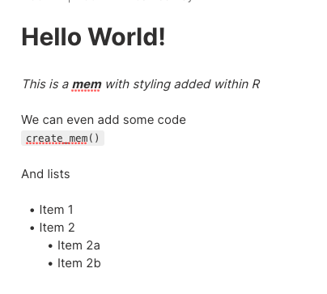

<!-- README.md is generated from README.Rmd. Please edit that file -->

```{r, include = FALSE}
knitr::opts_chunk$set(
  collapse = TRUE,
  comment = "#>",
  fig.path = "man/figures/README-",
  out.width = "100%"
)
```

# memr

<!-- badges: start -->
<!-- badges: end -->

The goal of memr is to provide an interface to the [mem.ai](https://get.mem.ai) platform within R via the [Mem API](https://docs.mem.ai/docs/) 

Initially, you will be able to create a new Mem from within R. As the [Mem API](https://docs.mem.ai/docs/)  develops, you will likely also be able to pull data into R to explore. 

## Installation

Currently the package is in development. You can install development version from [GitHub](https://github.com/) with:

```{undefined eval=FALSE}
# install.packages("devtools")
devtools::install_github("jimmyday12/memr")
```
## Example

The main purpose of `memr` is to create a new mem. This is done with the `create_mem()` function. 

You'll need to have an API token, which you can obtain from the Mem App on the [API Flow](https://mem.ai/flows/api) page. 


```{r example, eval=FALSE}
library(memr)

# Get API token
API_Key <- Sys.getenv("MEM_API")

create_mem("Hello World!", API_Key)
```

You can also format the text with markdown formatting. The exact formatting that is supported is outlined on the [Mem Markdown Formatting](https://docs.mem.ai/docs/general/mem-markdown-format) page. 

```{r markdown_example, eval=FALSE}
mem <- "# Hello World!

_This is a **mem** with styling added within R_

We can even add some code
```create_mem()```

And lists
* Item 1
* Item 2
    * Item 2a
    * Item 2b
"

create_mem(mem, API_Key)
```




## Future development
As the Mem API develops, more functionality will be added to the package. 

One key thing that will be explored is taking an existing R Markdown document and supplying this rather than having to write markdown into a character string. 

## Code of Conduct

Please note that the memr project is released with a [Contributor Code of Conduct](https://contributor-covenant.org/version/2/0/CODE_OF_CONDUCT.html). By contributing to this project, you agree to abide by its terms.
