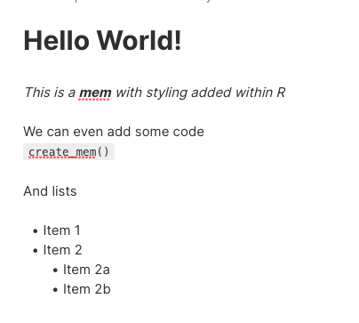

<!-- README.md is generated from README.Rmd. Please edit that file -->

# memr

<!-- badges: start -->

<!-- badges: end -->

The goal of memr is to provide an interface to the
[mem.ai](https://get.mem.ai) platform within R via the [Mem
API](https://docs.mem.ai/docs/)

Initially, you will be able to create a new Mem from within R. As the
[Mem API](https://docs.mem.ai/docs/) develops, you will likely also be
able to pull data into R to explore.

## Installation

Currently the package is in development. You can install development
version from [GitHub](https://github.com/) with:

``` undefined
# install.packages("devtools")
devtools::install_github("jimmyday12/memr")
```

## Example

The main purpose of `memr` is to create a new mem. This is done with the
`create_mem()` function.

You’ll need to have an API token, which you can obtain from the Mem App
on the [API Flow](https://mem.ai/flows/api) page.

``` r
library(memr)

# Get API token
API_Key <- Sys.getenv("MEM_API")

create_mem("Hello World!", API_Key)
```

You can also format the text with markdown formatting. The exact
formatting that is supported is outlined on the [Mem Markdown
Formatting](https://docs.mem.ai/docs/general/mem-markdown-format) page.

```` r
mem <- "# Hello World!

_This is a **mem** with styling added within R_

We can even add some code
```create_mem()```

And lists
* Item 1
* Item 2
    * Item 2a
    * Item 2b
"

create_mem(mem, API_Key)
````



## Future development

As the Mem API develops, more functionality will be added to the
package.

One key thing that will be explored is taking an existing R Markdown
document and supplying this rather than having to write markdown into a
character string.

## Code of Conduct

Please note that the memr project is released with a [Contributor Code
of
Conduct](https://contributor-covenant.org/version/2/0/CODE_OF_CONDUCT.html).
By contributing to this project, you agree to abide by its terms.
